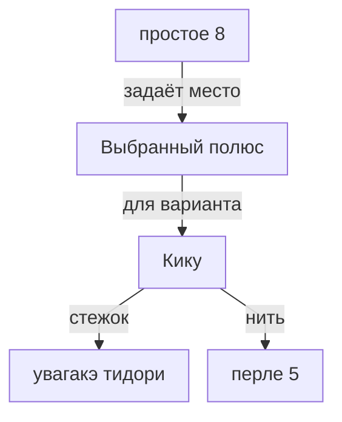

> Разметка задаёт места для узоров. У каждого варианта свои требования к стежку и нити.

## От разметки к узору

Нажми на название, чтобы открыть разметку, узор, стежок или нить. Это требования выбранной кику S8, не обещание поддержки всего семейства.

## Что дают другие разметки

- [[C8]]: хиси (заявлено, проверить); асаноха (заявлено, проверить).
- [[C10]]: хоси (заявлено, проверить); бара (заявлено, проверить).
- [[простое 4]]: сикаку (заявлено, проверить).
- [[простое 16]]: кику 16 (заявлено, проверить).

В заметке каждой разметки есть своя схема вариантов. Пунктир означает непроверенное утверждение, а не запрет.

## Можно ли сочетать два узора

- Место: помещаются ли они в выбранных областях шара?
- Подготовка: нужны ли одному узору уже вышитые элементы другого?
- Нить: где разрешены проходы сверху и снизу, нет ли столкновений?

Эта карта пока не вычисляет такие сочетания. Совместимость каждого узора с разметкой сама по себе не доказывает совместимость двух узоров.

## Подробнее

- [[00 Совместимость узоров]]: все варианты и границы наших знаний.
- [[00 Состояние реализации]]: что уже работает, проверки и оставшиеся задачи.

## Общий граф справа

Он показывает ссылки между заметками, но не умеет подписывать их смысл так, как схемы выше. Для конкретного узора полезнее локальный граф; для всего каталога оставлены свойства типов.
У одноимённых сущностей подписи различаются: «Узор · сикаку» и «Стежок · сикаку». Неподтверждённые связи разметки намеренно не превращены в обычные рёбра.
Масштаб, силы и раскладка твоего общего графа не перезаписываются генератором.

---

*Собрано `scripts/build-craft-vault.mts` из кода игры. Править — там: эти файлы перезаписываются.*
