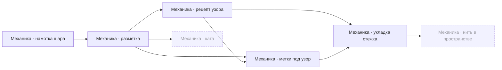

# Темари — карта

> Игрок наматывает шар, размечает его нитями и вышивает по меткам. Тянет не сюжет, а то, что рука кладёт настоящую нить:
> ряд ложится поверх ряда, и промах виден сразу — как в ремесле.

## Что можно вышить на выбранной разметке

Откройте [[00 Совместимость узоров]]: точные разметки, основания совместимости и реализация показаны отдельно.
Отсутствие рецепта в игре не означает невозможность узора в ремесле. Порядок механик ниже отвечает на другой вопрос.

## Стадия

**Каталог на 46 строк, а шьётся из него одна связка** — «Кику» на «простое 8» стежком «увагакэ тидори» нитью «перле 5». Это не ошибка карты: каталог ведётся заранее, а компилятор рецептов пока один.

| что | строк в каталоге | показано в мастерской | доходит до нитки на шаре | отложено |
| --- | ---: | --- | --- | ---: |
| узоры | 12 | 5 (включая свободный эскиз) | **1** — своя геометрия только у «Кику» | 11 |
| разметки | 9 | 4 (включая «без сетки») | **1** — на остальных шить нечем | 7 |
| стежки | 12 | выбора нет — приходит с рецептом | **1** из 3, которые движок умеет назвать | 11 |
| нити | 8 | выбирается цвет, не нить | **5** — 3 прохода намотки, 1 нить разметки, 1 нить рецепта | 3 |
| размеры шара | 5 | выбора нет | **1** — `MARI_C_CM` = 24 см вписан константой | 4 |

Чего нет вовсе: выбора нити и размера шара, второго рецепта, входа в режим ката.

## Как это устроено

Стрелка читается «что за чем»: от того, что уже есть, к тому, что оно открывает.
Узел — механика, а не строка каталога: каталог лежит внутри механики. Пунктиром — собрано, но в игре не включено.
Нажатие на узел открывает её заметку.

## Механики

- [[Механика · намотка шара]] — Шар обматывается нитью до ровной сферы — и до неё ни одно другое действие не открыто. **работает**, живых строк 4 из 8.
- [[Механика · разметка]] — Дзивари: большие круги делят поверхность и задают, где вообще может стоять стежок. **работает**, живых строк 3 из 9.
- [[Механика · рецепт узора]] — Рецепт — то единственное, что решает, дадут ли шить этот узор на этой разметке. **работает**, живых строк 1 из 12.
- [[Механика · метки под узор]] — Прежде чем шить, игрок ставит булавки ровно туда, где рецепт назначил метки. **работает**, живых строк 1 из 3.
- [[Механика · укладка стежка]] — Кагари: рецепт разворачивается в ряд операций, и нить ложится виток за витком поверх уже лежащих. **работает**, живых строк 1 из 12.
- [[Механика · нить в пространстве]] — Настоящая толстая нить: длина, изгибная жёсткость, контакт с шаром и с собой — вместо дуги по сфере. **собрано, но не в игре**, живых строк 0 из 10.
- [[Механика · ката]] — Отдельный режим: не шить, а заливать грани разметки в цвет по образцу. **собрано, но не в игре**, живых строк 0 из 5.

## Что осталось

- **Второй рецепт.** Без него 11 строк узоров и 8 разметок стоят на месте, а 3 кнопки в мастерской гаснут с подписью «Позже». Держит: [[Механика · рецепт узора]].
- **Перехлёсты.** Отрисовка умеет только поднимать нить; там, где по ремеслу она должна пройти ПОД пучком, рисунок остаётся неверным. Держит: [[Механика · укладка стежка]].
- **Собрано, но не в игре: нить в пространстве.** Перенести это в мастерскую нельзя одной заменой: решатель считает медленно, а кадр должен собираться за миллисекунды. Держит: [[Механика · нить в пространстве]].
- **Собрано, но не в игре: ката.** Кнопки «ката» на титуле нет: `enterKata` объявлен в хранилище состояния и не вызван ни из одного файла интерфейса. Держит: [[Механика · ката]].
- **Каталог не управляет игрой.** `library.ts` отсутствует в замыкании `src/pages.tsx`. Сборщик теперь сверяет точный рецепт строки с `motifSupport` и адаптером разметки, но это не доказывает исправность контактов или человеческую приёмку.

## Чего здесь нет

- На чём стоят числа и что из них наш выбор — `docs/assumptions.md`, `spec/craft-sources.md`, `spec/embroidery-model.md`.
- Текущая правка, проверки и договорённости этапа — `STATE.md` и `HANDOFF.md`.
- Открытые вопросы поимённо — issues на GitHub.
- Пересказа спецификаций здесь нет намеренно, чтобы они не разошлись.

---

*Собрано `scripts/build-craft-vault.mts` из кода игры. Править — там: эти файлы перезаписываются.*
