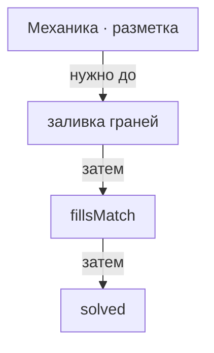

# Механика · ката

> Отдельный режим: не шить, а заливать грани разметки в цвет по образцу.

- Состояние: **собрано, но не в игре**
- Нужна: [[Механика · разметка]]
- Без неё не работает: ничего
- Живых строк каталога: **0 из 5**

У каждой головоломки своя разметка, своя палитра и целевая раскладка; совпадение проверяет `fillsMatch`, решённые копятся в `solved`.
Режим целиком собран — состояние, отрисовка, подсчёт решённых в накладке.
Попасть в него нельзя: `enterKata` не вызывается ни из одного файла интерфейса.

## Как работает

Читайте сверху вниз: что требуется до действия, что идёт затем и что оно открывает.

## Каталог: головоломки

- Север и юг — Два полушария, две нити — входа в режим нет
- Доли — Через одну по меридиану — входа в режим нет
- Восемь граней — Соседние грани — разный цвет — входа в режим нет
- Четыре ветра — Противоположные грани одного цвета — входа в режим нет
- Хризантема — Пояса от полюса к экватору — входа в режим нет

Живых: 0 из 5.

## Чем ограничена

- Заливка грани — не вышивка: узор здесь не шьётся, а закрашивается.
- Кнопки «ката» на титуле нет: `enterKata` объявлен в хранилище состояния и не вызван ни из одного файла интерфейса.

---

*Собрано `scripts/build-craft-vault.mts` из кода игры. Править — там: эти файлы перезаписываются.*
