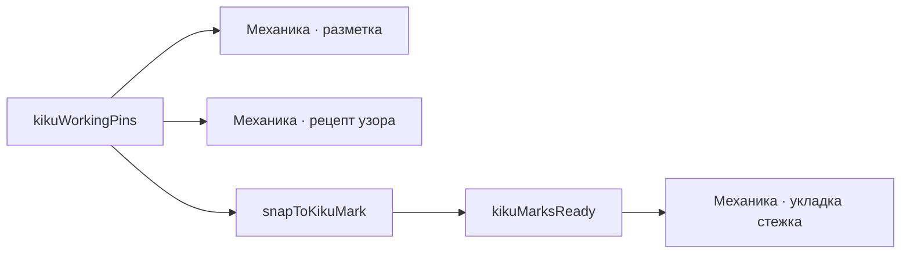

---
нужна:
  - "[[Механика · разметка]]"
  - "[[Механика · рецепт узора]]"
---

# Механика · метки под узор

> Прежде чем шить, игрок ставит булавки ровно туда, где рецепт назначил метки.

- Состояние: **работает**
- Нужна: [[Механика · разметка]], [[Механика · рецепт узора]]
- Без неё не работает: [[Механика · укладка стежка]]
- Живых строк каталога: **1 из 3**

`kikuWorkingPins` выдаёт рабочие метки полюса: сам полюс плюс внешние точки на трети пути от экватора.
`snapToKikuMark` притягивает нажатие к ближайшей, `kikuMarksReady` держит кнопку шитья, пока стоят не все.
Метки приходят из рецепта: без него `kikuWorkingPins` возвращает пустой список, и ставить нечего.

## Как работает

Стрелка читается «что за чем»: слева то, что делают раньше.

## Каталог: рабочие метки по разметкам

- **простое 8 — 9 рабочих меток** — метки есть, кику по ним шьётся
- C8 — 0 рабочих меток — меток нет: рецепта под эту разметку не существует
- C10 — 0 рабочих меток — меток нет: рецепта под эту разметку не существует

Живых: 1 из 3.

## Чем ограничена

- Метки умеет выдавать только кику: у любого другого узора своего набора меток в коде нет.
- Метки дзивари и рабочие метки узора — разные вещи: дальний полюс и экватор держат разметку, но не этот цветок.

---

*Собрано `scripts/build-craft-vault.mts` из кода игры. Править — там: эти файлы перезаписываются.*
