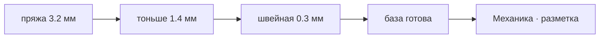

# Механика · намотка шара

> Шар обматывается нитью до ровной сферы — и до неё ни одно другое действие не открыто.

- Состояние: **работает**
- Нужна: ничего — это начало цепочки
- Без неё не работает: [[Механика · разметка]]
- Живых строк каталога: **4 из 8**

Три прохода, толстый к тонкому: пряжа, тоньше, швейная. Видно только верхний слой, он же держит булавки.
Намотку ведёт рука: виток кладётся по большому кругу, плоскость поворачивается на границе витка, а не посреди него.
В коде это `MariWinder` и `WrapBuffer`; готовность считается покрытием сферы, а не числом витков.

## Как работает

Стрелка читается «что за чем»: слева то, что делают раньше.

## Каталог: нити намотки и размеры шара

- **пряжа — 3.2 мм** — кладётся проходом намотки
- **тоньше — 1.4 мм** — кладётся проходом намотки
- **швейная — 0.3 мм** — кладётся проходом намотки
- малый — окружность 20 см — геометрия под 24 см, перенос не проверен
- **эталон — окружность 24 см** — на нём и считается геометрия
- средний — окружность 28 см — геометрия под 24 см, перенос не проверен
- крупный — окружность 32 см — геометрия под 24 см, перенос не проверен
- музыкальный — окружность 38 см — геометрия под 24 см, перенос не проверен

Живых: 4 из 8.

## Чем ограничена

- Размер шара не выбирается: `MARI_C_CM` = 24 см вписан константой, остальные 4 строки каталога существуют только как данные.
- Цвет намотки выбирается на титуле, толщина — ползунком; самой нити из каталога игрок не выбирает.

---

*Собрано `scripts/build-craft-vault.mts` из кода игры. Править — там: эти файлы перезаписываются.*
