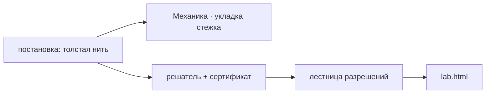

---
нужна:
  - "[[Механика · укладка стежка]]"
---

# Механика · нить в пространстве

> Настоящая толстая нить: длина, изгибная жёсткость, контакт с шаром и с собой — вместо дуги по сфере.

- Состояние: **собрано, но не в игре**
- Нужна: [[Механика · укладка стежка]]
- Без неё не работает: ничего
- Живых строк каталога: **0 из 10**

Задача поставлена как толстая нить: цель — интеграл квадрата скорости, кривизна ограничена радиусом `ρ_min`, сертификат ККТ на NNLS.
Нижний подхват, первый круг кику на простом 8 и лестница разрешений приняты численно и показываются в `lab.html`.
В игру это не включено: в кадре мастерской по-прежнему дуги и подъёмы из `stitches.ts`.

## Как работает

Стрелка читается «что за чем»: слева то, что делают раньше.

## Каталог: модули этой механики

- spatial-contact.ts — только в лаборатории
- curvature-bound.ts — только в лаборатории
- taut-contact.ts — только в лаборатории
- thread-geometry.ts — только в лаборатории
- lower-kagari.ts — только в лаборатории
- computed-lower-kagari.ts — только в лаборатории
- thick-rope-ladder.ts — только в лаборатории
- s8-kiku.ts — только в лаборатории
- spatial-spline-seed.ts — только в лаборатории
- spatial-catch-fixture.ts — нигде не подключён

Живых: 0 из 10.

## Чем ограничена

- Численная приёмка — не ремесленная: принята заданная конструкция, а не форма после затягивания.
- Сжатие нити не обосновано источником; сечение держится круглым и несжимаемым.
- Перенести это в мастерскую нельзя одной заменой: решатель считает медленно, а кадр должен собираться за миллисекунды.

---

*Собрано `scripts/build-craft-vault.mts` из кода игры. Править — там: эти файлы перезаписываются.*
