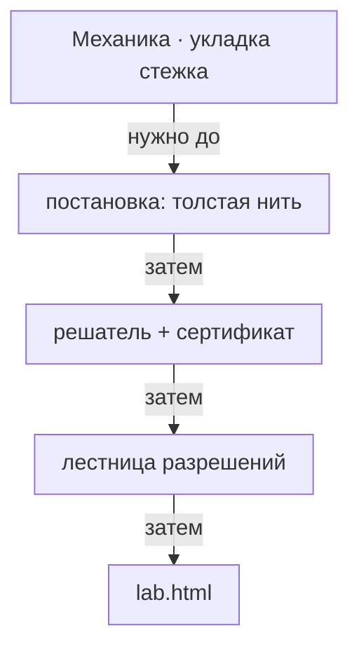

# Механика · нить в пространстве

> Настоящая толстая нить: длина, изгибная жёсткость, контакт с шаром и с собой — вместо дуги по сфере.

- Состояние: **собрано, но не в игре**
- Нужна: [[Механика · укладка стежка]]
- Без неё не работает: ничего
- Живых строк каталога: **6 из 10**

Задача поставлена как толстая нить: цель — интеграл квадрата скорости, кривизна ограничена радиусом `ρ_min`, сертификат ККТ на NNLS.
Нижний подхват, первый круг кику на простом 8 и лестница разрешений приняты численно и показываются в `lab.html`.
В игру это не включено: в кадре мастерской по-прежнему дуги и подъёмы из `stitches.ts`.

## Как работает

Читайте сверху вниз: что требуется до действия, что идёт затем и что оно открывает.

## Каталог: модули этой механики

- **spatial-contact.ts** — в игре
- **curvature-bound.ts** — в игре
- taut-contact.ts — только в лаборатории
- **thread-geometry.ts** — в игре
- lower-kagari.ts — только в лаборатории
- computed-lower-kagari.ts — только в лаборатории
- **thick-rope-ladder.ts** — в игре
- **s8-kiku.ts** — в игре
- **spatial-spline-seed.ts** — в игре
- spatial-catch-fixture.ts — нигде не подключён

Живых: 6 из 10.

## Чем ограничена

- Численная приёмка — не ремесленная: принята заданная конструкция, а не форма после затягивания.
- Сжатие нити не обосновано источником; сечение держится круглым и несжимаемым.
- Перенести это в мастерскую нельзя одной заменой: решатель считает медленно, а кадр должен собираться за миллисекунды.

---

*Собрано `scripts/build-craft-vault.mts` из кода игры. Править — там: эти файлы перезаписываются.*
