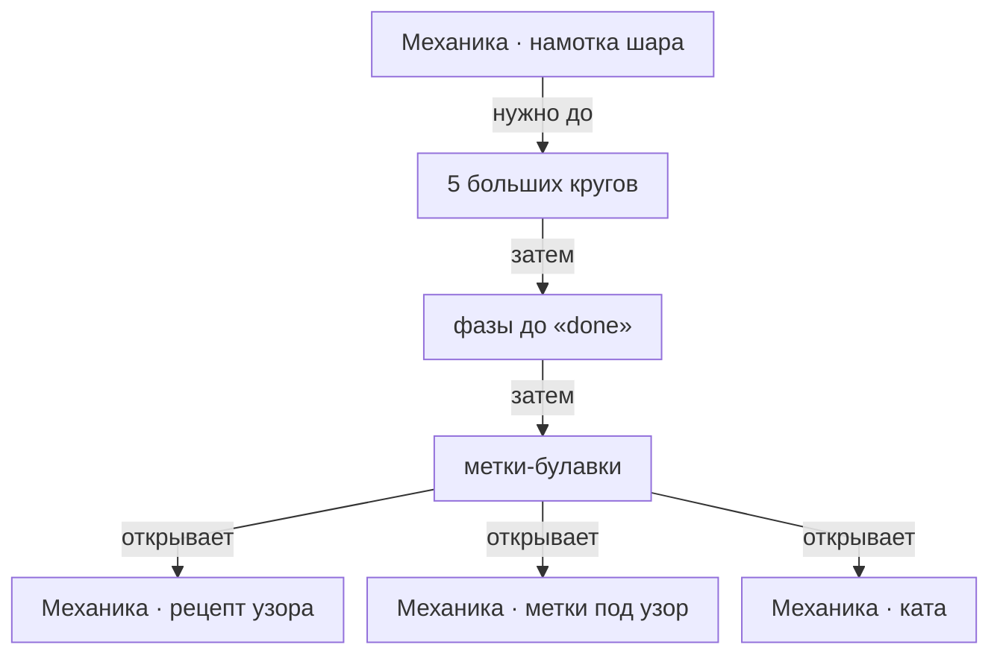

# Механика · разметка

> Дзивари: большие круги делят поверхность и задают, где вообще может стоять стежок.

- Состояние: **работает**
- Нужна: [[Механика · намотка шара]]
- Без неё не работает: [[Механика · рецепт узора]], [[Механика · метки под узор]], [[Механика · ката]]
- Живых строк каталога: **3 из 9**

Разметка идёт фазами: полоска на обхват, полюса, экватор, меридианы, у комбинированных — квадраты и V-линейка, потом юг.
Простое 8 — это 5 больших кругов, C8 добавляет ещё 4 квадратов у полюсов.
Пока фаза не доведена до конца, вышивка закрыта: это `needFinishedMarking` в `actions.ts`.

## Как работает

Читайте сверху вниз: что требуется до действия, что идёт затем и что оно открывает.

## Каталог: разметки

- **простое 8** — кнопка есть, и на ней есть что шить
- **C8** — кнопка есть, узора под неё нет
- **C10** — кнопка есть, узора под неё нет
- простое 4 — только данные, кнопки нет
- простое 10 — только данные, кнопки нет
- простое 16 — только данные, кнопки нет
- C6 — только данные, кнопки нет
- двойное C8 — только данные, кнопки нет
- таментай — только данные, кнопки нет

Живых: 3 из 9.

## Чем ограничена

- Кнопкой выбираются 3 разметки из 9; остальные — строки каталога без геометрии в коде.
- Узор с рецептом есть ровно на одной из них; на прочих разметка ложится, а шить нечем.

---

*Собрано `scripts/build-craft-vault.mts` из кода игры. Править — там: эти файлы перезаписываются.*
