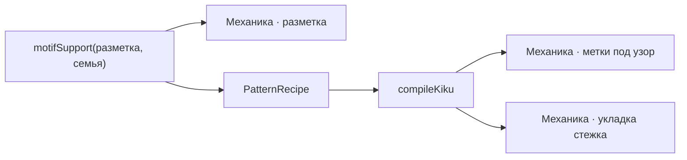

---
нужна:
  - "[[Механика · разметка]]"
---

# Механика · рецепт узора

> Рецепт — то единственное, что решает, дадут ли шить этот узор на этой разметке.

- Состояние: **работает**
- Нужна: [[Механика · разметка]]
- Без неё не работает: [[Механика · метки под узор]], [[Механика · укладка стежка]]
- Живых строк каталога: **1 из 12**

`motifSupport(разметка, семья)` спрашивают все кнопки узоров и обе кнопки шитья; без «да» кнопка гаснет с причиной.
`PatternRecipe` — не пересказ книги, а геометрия одной реализации: метки, доля пути от экватора, нить, перехлёст, растяжка, подхват.
Важная тонкость: `motifSupport` различает СЕМЬИ, а не строки каталога. Карта сверяет точный `divisionId` и собственный рецепт строки с реально исполняемым рецептом; поддержка семьи не открывает её варианты.

## Как работает

Стрелка читается «что за чем»: слева то, что делают раньше.

## Каталог: узоры

- **Кику** — подтверждено источником; точный рецепт исполняется, полная приёмка открыта
- кику оба полюса — заявлено в каталоге, не проверено; у этой строки нет своего рецепта
- сакаса-кику — точная разметка не установлена; у этой строки нет своего рецепта
- ситагакэ-кику — точная разметка не установлена; у этой строки нет своего рецепта
- судзидагику — точная разметка не установлена; у этой строки нет своего рецепта
- кику 16 — заявлено в каталоге, не проверено; у этой строки нет своего рецепта
- хоси — заявлено в каталоге, не проверено; у этой строки нет своего рецепта
- хиси — заявлено в каталоге, не проверено; у этой строки нет своего рецепта
- оби — точная разметка не установлена; у этой строки нет своего рецепта
- сикаку — заявлено в каталоге, не проверено; у этой строки нет своего рецепта
- асаноха — заявлено в каталоге, не проверено; у этой строки нет своего рецепта
- бара — заявлено в каталоге, не проверено; у этой строки нет своего рецепта

Живых: 1 из 12.

## Чем ограничена

- Поле `recipe` заполнено у 1 строки из 12.
- Кнопок узора в мастерской 4 плюс свободный эскиз; у трёх из них подпись «Позже» и запрет от `needRecipe`.
- `MOTIF_LIST` в `patterns.ts` перечисляет «none» и «kiku» — и не используется нигде, кроме своего теста: список узоров интерфейсу задают действия, а не он.

---

*Собрано `scripts/build-craft-vault.mts` из кода игры. Править — там: эти файлы перезаписываются.*
