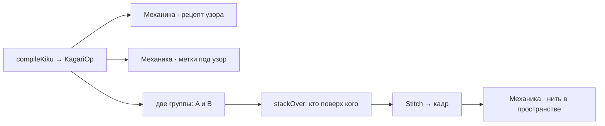

---
нужна:
  - "[[Механика · рецепт узора]]"
  - "[[Механика · метки под узор]]"
---

# Механика · укладка стежка

> Кагари: рецепт разворачивается в ряд операций, и нить ложится виток за витком поверх уже лежащих.

- Состояние: **работает**
- Нужна: [[Механика · рецепт узора]], [[Механика · метки под узор]]
- Без неё не работает: [[Механика · нить в пространстве]]
- Живых строк каталога: **1 из 12**

`compileKiku` превращает рецепт в `KagariOp` — положить на шар, подхватить у метки, встать поверх нужных прежних рядов (`stackOver`).
Рабочих нитей две, A и B, они идут попеременно и паркуются между кай; ряды считаются до вместимости полюса (`kikuFit`).
Дальше `stitches.ts` строит из этого ленты и трубки для кадра.

## Как работает

Стрелка читается «что за чем»: слева то, что делают раньше.

## Каталог: стежки

- **увагакэ тидори** — им и шьётся действующий рецепт
- тидори — рецепт умеет его назвать, но ни один рецепт не называет
- сакаса увагакэ — рецепт умеет его назвать, но ни один рецепт не называет
- ситагакэ тидори — движок этот стежок не знает
- судзидагику — движок этот стежок не знает
- санкаку — движок этот стежок не знает
- сикаку — движок этот стежок не знает
- мацуба — движок этот стежок не знает
- маки-кагари — движок этот стежок не знает
- дзёге додзи — движок этот стежок не знает
- коуса — движок этот стежок не знает
- недзири — движок этот стежок не знает

Живых: 1 из 12.

## Чем ограничена

- Тип `RecipeStitch` знает 3 имени, рецепт называет 1; остальные 9 строк каталога движку не имена, а текст.
- Стежок не выбирается отдельно: он приходит вместе с рецептом узора.
- Отрисовка умеет только поднимать нить над лежащей. Там, где по ремеслу нить должна пройти ПОД пучком, перехлёст остаётся неверным.

---

*Собрано `scripts/build-craft-vault.mts` из кода игры. Править — там: эти файлы перезаписываются.*
