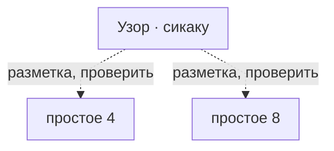
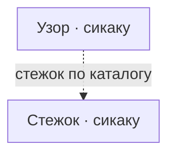

# Узор · сикаку

四角（shikaku） · square

Honka: квадрат на S4/S8.

## Что требуется этому варианту

Сплошная стрелка: требование источника или исполняемого рецепта. Пунктир: утверждение каталога или открытый вопрос.
Нажатие на именованный узел открывает его заметку. Это требования, не порядок шитья и не доказательство совместимости двух узоров.

## Чем и на чём

- Разметка: простое 4, простое 8 (заявлено в каталоге, не проверено)
- Основание: S4/S8 заявлены заметкой Honka; источник конкретного варианта и рецепт не проверены.
- Стежок: [[Стежок · сикаку]]
- Механика: Механика · рецепт узора
- Состояние: **к первой версии**

## Достижимость в игре

- Место по каталогу: только данные, кнопки нет (не доказательство наличия этой строки в интерфейсе)
- Действие семейства: нет
- Рецепт этой строки исполняется: **нет**; у этой строки нет своего рецепта
- Своя геометрия (поле `recipe`): **нет**
- Приёмка: исполняемый вариант этой строки не проверен

---

*Собрано `scripts/build-craft-vault.mts` из кода игры. Править — там: эти файлы перезаписываются.*
