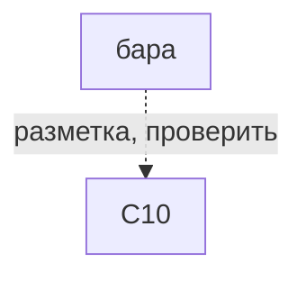
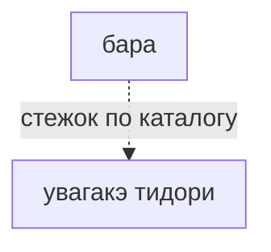

# бара

薔薇（bara） · rose

Не этот этап (#54).

## Что требуется этому варианту

Сплошная стрелка: требование источника или исполняемого рецепта. Пунктир: утверждение каталога или открытый вопрос.
Нажатие на именованный узел открывает его заметку. Это требования, не порядок шитья и не доказательство совместимости двух узоров.

## Чем и на чём

- Разметка: C10 (заявлено в каталоге, не проверено)
- Основание: C10 заявлено прежним каталогом; источник конкретного варианта и рецепт не проверены.
- Стежок: [[увагакэ тидори]]
- Механика: Механика · рецепт узора
- Состояние: **позже**

## Достижимость в игре

- Место по каталогу: только данные, кнопки нет (не доказательство наличия этой строки в интерфейсе)
- Действие семейства: нет
- Рецепт этой строки исполняется: **нет**; у этой строки нет своего рецепта
- Своя геометрия (поле `recipe`): **нет**
- Приёмка: исполняемый вариант этой строки не проверен

---

*Собрано `scripts/build-craft-vault.mts` из кода игры. Править — там: эти файлы перезаписываются.*
