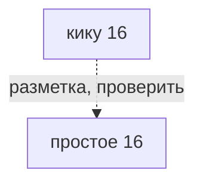
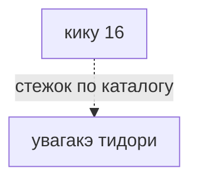

# кику 16

16段菊（16-layered kiku） · 16-layered kiku

Suess 16-layered. Skip 1 / S16.

## Что требуется этому варианту

Сплошная стрелка: требование источника или исполняемого рецепта. Пунктир: утверждение каталога или открытый вопрос.
Нажатие на именованный узел открывает его заметку. Это требования, не порядок шитья и не доказательство совместимости двух узоров.

## Чем и на чём

- Разметка: простое 16 (заявлено в каталоге, не проверено)
- Основание: S16 заявлено в заметке Suess 16-layered / Skip 1. Требуется сверка конкретного источника; это не готовый рецепт.
- Стежок: [[увагакэ тидори]]
- Механика: Механика · рецепт узора
- Состояние: **позже**
- Ход: от полюса
- Перехлёст: over-all
- Через сколько лучей: 1

## Достижимость в игре

- Место по каталогу: чип варианта (не доказательство наличия этой строки в интерфейсе)
- Действие семейства: `motif-kiku`; оно не выбирает все варианты семьи
- Рецепт этой строки исполняется: **нет**; у этой строки нет своего рецепта
- Своя геометрия (поле `recipe`): **нет**
- Приёмка: исполняемый вариант этой строки не проверен

## Та же семья

- Основной: Кику
- кику оба полюса — к первой версии
- сакаса-кику — к первой версии
- ситагакэ-кику — позже
- судзидагику — позже

---

*Собрано `scripts/build-craft-vault.mts` из кода игры. Править — там: эти файлы перезаписываются.*
