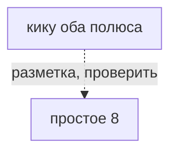
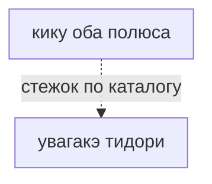

# кику оба полюса

菊（両極）（kiku both poles） · kiku both poles

Тот же стежок на юге. Студия поворачивает шар после северного цветка — чип не нужен.

## Что требуется этому варианту

Сплошная стрелка: требование источника или исполняемого рецепта. Пунктир: утверждение каталога или открытый вопрос.
Нажатие на именованный узел открывает его заметку. Это требования, не порядок шитья и не доказательство совместимости двух узоров.

## Чем и на чём

- Разметка: простое 8 (заявлено в каталоге, не проверено)
- Основание: Каталог описывает композицию на двух полюсах S8; отдельного рецепта этой строки нет.
- Стежок: [[увагакэ тидори]]
- Механика: Механика · рецепт узора
- Состояние: **к первой версии**
- Центры: оба полюса
- Ход: от полюса
- Перехлёст: over-all
- Через сколько лучей: 2

## Достижимость в игре

- Место по каталогу: чип варианта (не доказательство наличия этой строки в интерфейсе)
- Действие семейства: `motif-kiku`; оно не выбирает все варианты семьи
- Рецепт этой строки исполняется: **нет**; у этой строки нет своего рецепта
- Своя геометрия (поле `recipe`): **нет**
- Приёмка: исполняемый вариант этой строки не проверен

## Та же семья

- Основной: Кику
- сакаса-кику — к первой версии
- ситагакэ-кику — позже
- судзидагику — позже
- кику 16 — позже

---

*Собрано `scripts/build-craft-vault.mts` из кода игры. Править — там: эти файлы перезаписываются.*
