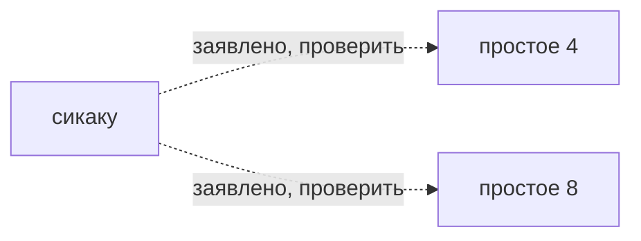

# сикаку

*四角（shikaku） · square*

Honka: квадрат на S4/S8.

## Чем и на чём

- Разметка: простое 4, простое 8 (заявлено в каталоге, не проверено)
- Основание: S4/S8 заявлены заметкой Honka; источник конкретного варианта и рецепт не проверены.
- Стежок: [[04 Стежки/сикаку|сикаку]]
- Механика: Механика · рецепт узора
- Состояние: **к первой версии**

## Достижимость в игре

- Место по каталогу: только данные, кнопки нет (не доказательство наличия этой строки в интерфейсе)
- Действие семейства: нет
- Рецепт этой строки исполняется: **нет**; у этой строки нет своего рецепта
- Своя геометрия (поле `recipe`): **нет**
- Приёмка: исполняемый вариант этой строки не проверен

## Что требуется этому варианту

Сплошная стрелка: подтверждённое требование этого варианта. Пунктир: непроверенное утверждение или вопрос.
Это не порядок действий и не схема прохода нити. Неуказанные сочетания остаются неизвестными, а не запрещёнными.

---

*Собрано `scripts/build-craft-vault.mts` из кода игры. Править — там: эти файлы перезаписываются.*
