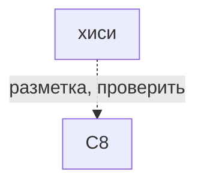
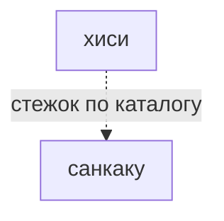

# хиси

菱（hishi） · diamond

Вложенный ромб по готовой грани. Заглушка.

## Что требуется этому варианту

Сплошная стрелка: требование источника или исполняемого рецепта. Пунктир: утверждение каталога или открытый вопрос.
Нажатие на именованный узел открывает его заметку. Это требования, не порядок шитья и не доказательство совместимости двух узоров.

## Чем и на чём

- Разметка: C8 (заявлено в каталоге, не проверено)
- Основание: C8 заявлено прежним каталогом; источник конкретного варианта и рецепт не проверены.
- Стежок: [[санкаку]]
- Механика: Механика · рецепт узора
- Состояние: **к первой версии**

## Достижимость в игре

- Место по каталогу: кнопка в мастерской (не доказательство наличия этой строки в интерфейсе)
- Действие семейства: `motif-hishi`; оно не выбирает все варианты семьи
- Рецепт этой строки исполняется: **нет**; у этой строки нет своего рецепта
- Своя геометрия (поле `recipe`): **нет**
- Приёмка: исполняемый вариант этой строки не проверен
- Кнопка семейства не означает готовый рецепт этой строки.

---

*Собрано `scripts/build-craft-vault.mts` из кода игры. Править — там: эти файлы перезаписываются.*
