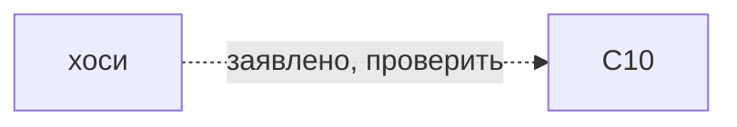

# хоси

*星かがり（hoshi kagari） · 5-point star*

ход 1-3-5-2-4. Иконка — заглушка.

## Чем и на чём

- Разметка: C10 (заявлено в каталоге, не проверено)
- Основание: C10 заявлено прежним каталогом; источник конкретного варианта и рецепт не проверены.
- Стежок: [[тидори]]
- Механика: Механика · рецепт узора
- Состояние: **к первой версии**

## Достижимость в игре

- Место по каталогу: кнопка в мастерской (не доказательство наличия этой строки в интерфейсе)
- Действие семейства: `motif-hoshi`; оно не выбирает все варианты семьи
- Рецепт этой строки исполняется: **нет**; у этой строки нет своего рецепта
- Своя геометрия (поле `recipe`): **нет**
- Приёмка: исполняемый вариант этой строки не проверен
- Кнопка семейства не означает готовый рецепт этой строки.

## Что требуется этому варианту

Сплошная стрелка: подтверждённое требование этого варианта. Пунктир: непроверенное утверждение или вопрос.
Это не порядок действий и не схема прохода нити. Неуказанные сочетания остаются неизвестными, а не запрещёнными.

---

*Собрано `scripts/build-craft-vault.mts` из кода игры. Править — там: эти файлы перезаписываются.*
