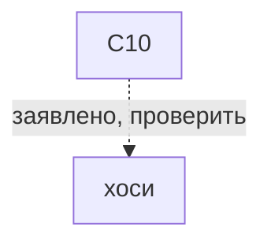
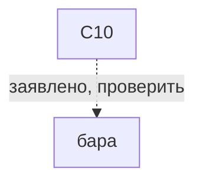

# C10

*10等分の組み合わせ（jutobun no kumiawase） · C10*

12 десятилучевых. Серый, пока C8 честный.

## Какие варианты с ней связаны

Сплошная связь подтверждена для указанного варианта, пунктир требует проверки. Узлы открывают заметки; наличие связи не означает готовую реализацию.

## О ней

- Вид: комбинированное
- Центров: 12
- Лучей: 12 центров по 10 лучей
- Построена на: [[простое 10]]
- Механика: Механика · разметка
- Состояние: **к первой версии**

## Варианты с подтверждённой совместимостью

- В каталоге нет подтверждённых вариантов. Это не запрет ремесла.

## Заявлено в каталоге, нужно проверить

- хоси: C10 заявлено прежним каталогом; источник конкретного варианта и рецепт не проверены.
- бара: C10 заявлено прежним каталогом; источник конкретного варианта и рецепт не проверены.

## Достижимость в игре

- В интерфейсе: кнопка в мастерской (действие `jiwari-c10`)
- Исполняемых вариантов на этой точной разметке: 0 из 2 заявленных.
- ⚠️ разметку выбрать можно, а узора под неё пока нет.

---

*Собрано `scripts/build-craft-vault.mts` из кода игры. Править — там: эти файлы перезаписываются.*
