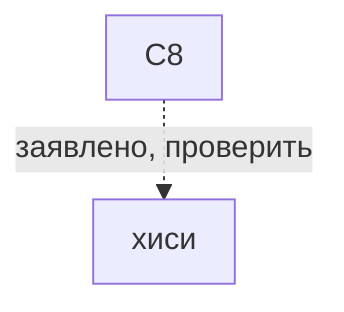
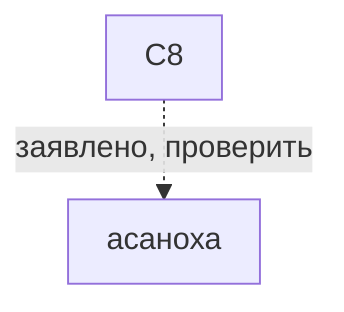

# C8

*8等分の組み合わせ（hachitobun no kumiawase） · C8*

6 восьмилучевых центров.

## Какие варианты с ней связаны

Сплошная связь подтверждена для указанного варианта, пунктир требует проверки. Узлы открывают заметки; наличие связи не означает готовую реализацию.

## О ней

- Вид: комбинированное
- Центров: 6
- Лучей: 6 центров по 8 лучей и 8 центров по 6
- Построена на: [[простое 8]]
- Механика: Механика · разметка
- Состояние: **в игре сейчас**

## Варианты с подтверждённой совместимостью

- В каталоге нет подтверждённых вариантов. Это не запрет ремесла.

## Заявлено в каталоге, нужно проверить

- хиси: C8 заявлено прежним каталогом; источник конкретного варианта и рецепт не проверены.
- асаноха: C8 заявлено прежним каталогом; источник конкретного варианта и рецепт не проверены.

## Достижимость в игре

- В интерфейсе: кнопка в мастерской (действие `jiwari-c8`)
- Исполняемых вариантов на этой точной разметке: 0 из 2 заявленных.
- ⚠️ разметку выбрать можно, а узора под неё пока нет.

---

*Собрано `scripts/build-craft-vault.mts` из кода игры. Править — там: эти файлы перезаписываются.*
