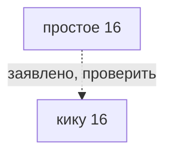

# простое 16

*単純16等分（tanjyun 16 toubun） · Simple 16*

Заявлено для «кику 16»; требуется сверка конкретного источника.

## Какие варианты с ней связаны

Сплошная связь подтверждена для указанного варианта, пунктир требует проверки. Узлы открывают заметки; наличие связи не означает готовую реализацию.

## О ней

- Вид: простое деление
- Центров: 2
- Лучей: 16 лучей у каждого полюса
- Механика: Механика · разметка
- Состояние: **позже**

## Варианты с подтверждённой совместимостью

- В каталоге нет подтверждённых вариантов. Это не запрет ремесла.

## Заявлено в каталоге, нужно проверить

- кику 16: S16 заявлено в заметке Suess 16-layered / Skip 1. Требуется сверка конкретного источника; это не готовый рецепт.

## Достижимость в игре

- В интерфейсе: только данные, кнопки нет
- Исполняемых вариантов на этой точной разметке: 0 из 1 заявленных.

---

*Собрано `scripts/build-craft-vault.mts` из кода игры. Править — там: эти файлы перезаписываются.*
