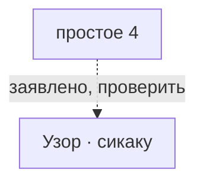

# простое 4

*単純4等分（tanjyun 4 toubun） · Simple 4*

В каталоге указан Suess Autumn Moon. Это не ограничивает другие узоры на Simple 4.

## Какие варианты с ней связаны

Сплошная связь подтверждена для указанного варианта, пунктир требует проверки. Узлы открывают заметки; наличие связи не означает готовую реализацию.

## О ней

- Вид: простое деление
- Центров: 2
- Лучей: 4 луча у каждого полюса
- Механика: Механика · разметка
- Состояние: **к первой версии**

## Варианты с подтверждённой совместимостью

- В каталоге нет подтверждённых вариантов. Это не запрет ремесла.

## Заявлено в каталоге, нужно проверить

- сикаку: S4/S8 заявлены заметкой Honka; источник конкретного варианта и рецепт не проверены.

## Достижимость в игре

- В интерфейсе: только данные, кнопки нет
- Исполняемых вариантов на этой точной разметке: 0 из 1 заявленных.

---

*Собрано `scripts/build-craft-vault.mts` из кода игры. Править — там: эти файлы перезаписываются.*
