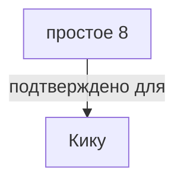
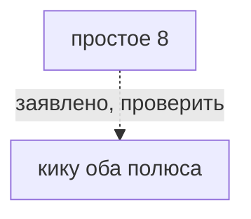
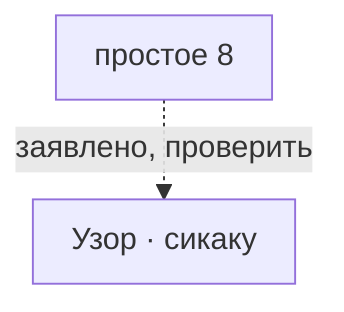

# простое 8

*単純8等分（tanjyun 8 toubun） · Simple 8*

Два полюса, экватор, 8 лучей. Учебный старт.

## Какие варианты с ней связаны

Сплошная связь подтверждена для указанного варианта, пунктир требует проверки. Узлы открывают заметки; наличие связи не означает готовую реализацию.

## О ней

- Вид: простое деление
- Центров: 2
- Лучей: 8 лучей у каждого полюса
- Механика: Механика · разметка
- Состояние: **в игре сейчас**

## Варианты с подтверждённой совместимостью

- Кику: рецепт исполняется; приёмка открыта

## Заявлено в каталоге, нужно проверить

- кику оба полюса: Каталог описывает композицию на двух полюсах S8; отдельного рецепта этой строки нет.
- сикаку: S4/S8 заявлены заметкой Honka; источник конкретного варианта и рецепт не проверены.

## Достижимость в игре

- В интерфейсе: кнопка в мастерской (действие `jiwari-simple`)
- Исполняемых вариантов на этой точной разметке: 1 из 3 заявленных.

---

*Собрано `scripts/build-craft-vault.mts` из кода игры. Править — там: эти файлы перезаписываются.*
