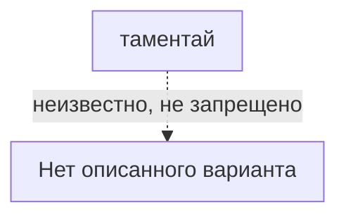

# таментай

*多面体（tamentai） · multicenter marking*

Не этот этап (#54).

## Какие варианты с ней связаны

Сплошная связь подтверждена для указанного варианта, пунктир требует проверки. Узлы открывают заметки; наличие связи не означает готовую реализацию.

## О ней

- Вид: дополнительное
- Механика: Механика · разметка
- Состояние: **позже**

## Варианты с подтверждённой совместимостью

- В каталоге нет подтверждённых вариантов. Это не запрет ремесла.

## Заявлено в каталоге, нужно проверить

- Нет заявленных вариантов.

## Достижимость в игре

- В интерфейсе: только данные, кнопки нет
- Исполняемых вариантов на этой точной разметке: 0 из 0 заявленных.

---

*Собрано `scripts/build-craft-vault.mts` из кода игры. Править — там: эти файлы перезаписываются.*
