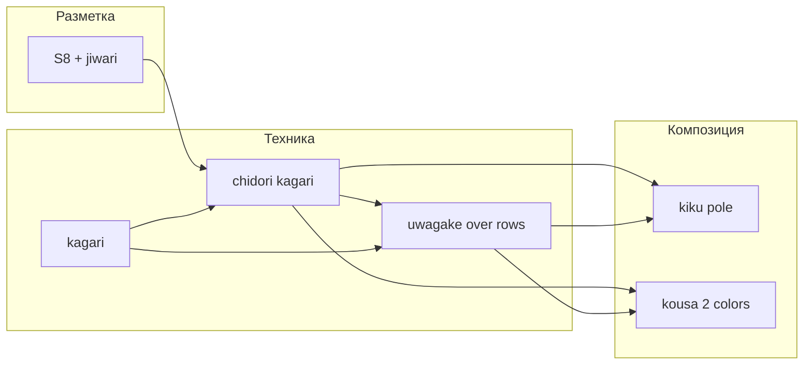

# Карта: разметка × техника × композиция

Цель: показать, какими **общими операциями** симулятор может покрывать классические темари, и где жёсткие ограничения. Реестр требований в коде: [craft-coverage.ts](../../src/components/temari/craft-coverage.ts), [jta-coverage.md](../../spec/jta-coverage.md).

## Оси карты

| Ось | Примеры | Не путать с |
|-----|---------|-------------|
| **Разметка** | S8, C8, C10, доп. линии GT41 | Числом лепестков или цветов |
| **Техника** | kagari, chidori, uwagake, kousa, hitohudegake | Названием узора «kiku» |
| **Композиция** | kiku у полюса, hoshi, obi, jyouge douji | Одним рецептом GTxx |
| **Рецепт** | GT14, GT55, GT41 | Универсальным законом |

## Операции исполнения (целевой «конструктор»)

Каждая операция должна иметь рецепт, порты прокола, хронологию over/under и статус поддержки.

| Операция | Смысл | Примеры | Статус в проекте |
|----------|--------|---------|------------------|
| `anchorStart` / `anchorEnd` | Скрытое закрепление 2–5 cm | Любой мотив | **спроектировано**, не полная физика |
| `surfaceLay` | Пролёт по поверхности между проколами | Chidori дуги | частично (taut/spatial) |
| `lowerKagari` | Chidori нижний подхват + over входящей | GT14, GT55 kiku | контракт **источник**; C8 coupon **численно** с оговорками |
| `upperKagari` | Верхний подхват; узкий → uwagake wide | Row 1 vs row 2+ | row 3 **unresolved** |
| `threadOverRows` | Uwagake: over пучка перед верхним | GT14 | рецепт **источник**; рендер **гипотеза** |
| `park` / `resume` | Временная пауза нити | GT14 A/B | **источник**; `KagariTrace.resume` |
| `hiddenPass` | Переход под намоткой | GT57 transitions | не обобщать на все цвета |
| `jiwariGuide` | Разметочная лента | S8/C8 | local-marking **численно** |
| `pinPlacement` | Булавка на трети, 5 mm | GT14 | **источник**; булавка ≠ опора (#35) |

## Матрица примеров (реальные работы / рецепты)

| Разметка | Техника | Композиция | Пример | Поддержка симулятора |
|----------|---------|------------|--------|----------------------|
| S8 | chidori → uwagake chidori | kiku, 2 цвета kousa | **GT14** | S8 kiku partial; **контрольный trace** [gt14-process-trace.md](gt14-process-trace.md) |
| C8 | uwagake chidori + kousa base | kiku на 6 центрах | GT55 | Основание ромбы/△ **не** реализовано; один центр — coupon |
| C8 | chidori (1 круг) | инженерный образец | c8-thread-coupon | **численно** 228 cases; не GT55 |
| C10 | uwagake + shitagake, 2×5 групп | kiku variant | GT41 | **исследование**; скрытые нижние острия |
| S8 | две нити | A1→B1 | GT14 | s8-two-threads **численно** |
| S4/S6/S12 | jyouge, obi, … | Honka controls | craft-coverage | разметка есть; рецепты **не** назначены |

## GT14 как hub

**Вывод:** освоение GT14 на одном полюсе даёт операции для большого класса полюсных kiku на S8 и нижний/верхний контракт для C8 kiku — **но не** основание GT55 и **не** C10 без дополнительных рецептов.

## Ограничения по вариантам

| Вариант | Ограничение |
|---------|-------------|
| GT14 на S8 | Две группы, park, до экватора; не масштабируется на «6 цветов GT55» |
| GT55 | 9 рядов основания обязательны; одна группа kiku; без GT14-style A/B |
| Uwagake variations №3 | Under previous tops — **другой** over/under порядок |
| GT41 C10 | Доп. линии, 2×5, shitagake; часть пути скрыта |
| Асимметричные композиции | Правила разметки/техники могут сохраняться; **свободный режим не согласован** (jta-coverage) |

## Путь расширения (согласован с STATE)

1. Simple 8: GT14 trace → один визит канала → три ряда → A/B (**HANDOFF**).
2. C8: один центр с правильным lower catch → GT55 osnovanie → 3 kiku circles.
3. C10: выбрать свой рецепт (не автоматически 12× один шаблон).
4. Материалы: [material-scale.md](../../spec/material-scale.md) перед плотностью и сжатием.

## Подтверждение поддержки узора

Узор считается **поддерживаемым**, только если есть:

1. Ссылка на рецепт (ID в sources-catalog).
2. Исполняемый рецепт или `motifSupport` без `UnsupportedPatternError`.
3. Проверяемый образец (тест или lab) с указанным статусом (**численно** / **визуально** / **мастер**).

GT14: (1) да, (2) partial S8, (3) rows 1–2 **численно**, row 3 и полная композиция — **нет**.
